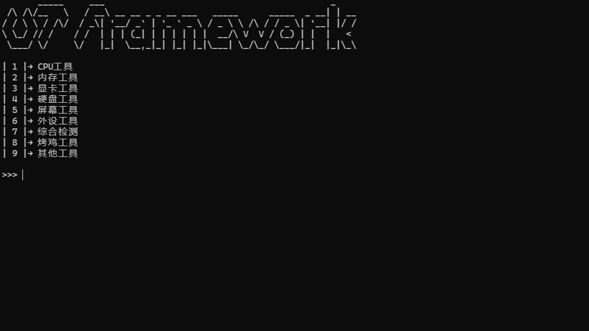
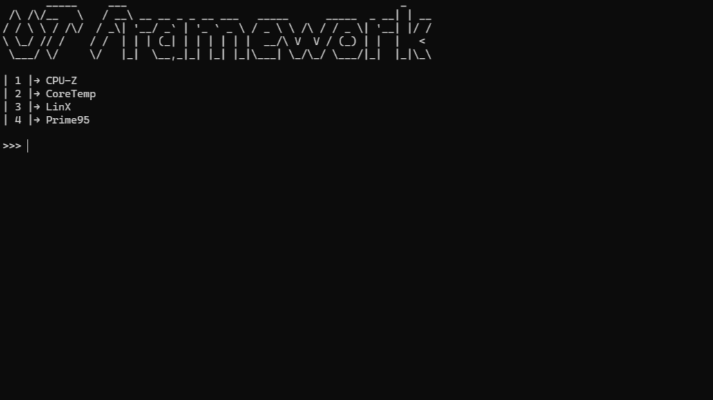

# Universal Tool Framework

Universal Tool Framework 是一个基于 Node.js 的命令行工具框架，用于统一管理和执行各种系统命令和工具。提供交互式菜单系统，支持多级菜单导航和跨平台工具执行管理。

## 项目概述

Universal Tool Framework 是一个高度可定制的系统工具管理框架，具有以下特点：

- **高度可定制**：框架的几乎所有组件都可以自定义，包括菜单结构、工具路径、用户界面等
- **跨平台灵活性**：基于 Node.js 构建，具备跨平台运行能力，可根据不同操作系统配置相应工具
- **交互式菜单系统**：基于配置文件的动态菜单系统，支持数字输入和方向键导航
- **工具执行管理**：根据用户选择执行对应的工具，支持不同系统架构
- **架构自动检测**：自动检测系统架构（ARM64、ARM32、X86、X86_64）并选择合适的工具版本
- **架构选择器**：允许用户手动选择要使用的工具架构，支持数字输入和方向键选择
- **配置驱动**：菜单结构和工具路径由配置文件定义，便于扩展
- **多平台支持**：支持多种系统架构，自动选择合适的工具版本
- **完全自定义工具文件夹**：tools 文件夹内容完全可自定义，甚至可以删除并替换为用户自己的工具集
- **框架可塑性**：通过配置文件可以轻松实现完全不同的功能用途，而不仅限于系统诊断工具

## 软件界面展示

以下为 Universal Tool Framework 的界面展示图片：




## 安装和使用

### 系统要求

- Node.js (版本 14.0 或更高)
- 跨平台支持：可在 Windows、Linux 和 macOS 上运行
- 针对不同操作系统可配置相应的工具集

### 安装步骤

1. 克隆或下载项目到本地：

```bash
npm i -g @qingxuan2000/utf@latest
```

### 使用方法

运行项目：

```bash
utf
```

运行后，您将看到一个交互式菜单，可以通过数字选择或方向键导航来运行不同的工具：

- **数字输入模式**：输入菜单项对应的数字来选择
- **方向键导航模式**：使用方向键选择菜单项（上/下键移动，回车确认，左键返回上级菜单，右键返回主菜单）
- **特殊命令**：'b' 返回上级菜单，'m' 返回主菜单

## 项目结构

```
universal-tool-framework/
├── index.js                # 程序入口文件
├── package.json            # 项目配置文件
├── README.md               # 项目说明文件
├── config/                 # 配置文件目录
│   ├── menu.json           # 主配置文件（菜单结构、设置等）
│   ├── settings.json       # 应用设置配置
│   ├── arch_picker.json    # 架构选择器配置
│   ├── logo                # 应用Logo文件
│   └── logo.json           # Logo配置
├── img/                    # 图片资源目录
│   ├── 主菜单.png          # 主菜单界面截图
│   └── 子菜单.png          # 子菜单界面截图
├── src/                    # 源代码目录
│   ├── applicationController.js # 应用程序主控制器
│   ├── configHandler.js    # 配置文件处理
│   ├── menuController.js   # 菜单控制器
│   ├── menuEngine.js       # 菜单引擎
│   ├── systemUtils.js      # 系统工具函数
│   ├── toolExecutor.js     # 工具执行器
│   └── uiHandler.js        # 用户界面处理器
├── tools/                  # 工具集目录（包含各种系统工具）
└── lib/                    # 库目录（当前为空）
```

## 功能特性

### 菜单系统

- 基于配置文件的动态菜单系统，支持多级菜单导航
- 可通过 `config/menu.json` 文件自定义菜单结构
- 支持子菜单、可执行文件和导航命令
- 支持数字输入和方向键导航两种交互方式

### 工具执行

- 根据用户选择执行对应的工具
- 支持为不同系统架构指定不同的工具路径
- 自动检测系统架构并选择合适的工具版本

### 架构检测

- 自动检测系统架构（ARM64、ARM32、X86、X86_64）
- 支持手动选择要使用的工具架构，架构选择器也支持数字输入和方向键导航
- 可通过配置启用或禁用架构选择器

### 交互式界面

- **数字输入模式**：支持通过数字选择菜单项
- **方向键导航模式**：支持方向键导航菜单（上/下键选择，左键返回上级菜单，右键返回主菜单，回车确认）
- **菜单对齐优化**：选中项使用反色高亮显示，确保所有菜单项保持对齐，避免视觉凸起
- **输入提示符**：可根据配置自定义输入提示符
- **清屏功能**：可配置是否在显示菜单前清屏
- **Logo显示**：支持自定义Logo显示
- **清晰的用户提示和错误处理**

### 工具包管理

- **多工具包支持**：可以保存和管理多个工具包
- **工具包切换**：通过按 `p` 键快速在不同工具包之间切换
- **工具包信息显示**：显示工具包的名称、版本和路径信息
- **持久化存储**：工具包列表保存在用户目录下的 `tool_packages.json` 文件中
- **路径去重**：自动识别相同工具包的不同路径表示，避免重复添加

### 跨平台能力

- 基于 Node.js 构建，原生支持 Windows、Linux 和 macOS
- 可根据操作系统配置不同的工具执行命令
- 支持为不同平台自定义工具路径和执行方式

## 工具类别

**tools 文件夹完全可自定义**，您可以根据需要添加、修改或删除任何工具，甚至可以完全替换整个工具集。框架的配置驱动设计使您可以轻松创建完全个性化的工具集合，适用于任何用途而不仅限于系统诊断工具。

## JSON 配置文件构成

Universal Tool Framework 使用 JSON 配置文件来定义菜单结构和应用设置。框架的灵活性完全基于这些配置文件，您可以轻松定制菜单布局、工具路径和应用行为。

### 菜单配置 (config/menu.json)

菜单配置文件定义了整个菜单系统的结构，包含多个菜单对象，其中必须包含一个名为 `main` 的主菜单。配置文件的基本结构如下：

```json
{
  "menu": {
    "main": {
      "title": "",
      "items": [
        // 菜单项数组
      ]
    },
    "submenu_name": {
      "title": "",
      "parent": "main", // 指向父菜单
      "items": [
        // 菜单项数组
      ]
    }
  }
}
```

每个菜单对象包含以下字段：

- `title`: 菜单标题（字符串），显示在菜单顶部
  - 可以设置为空字符串 `""`，此时不显示标题
  - 支持 `\n` 换行符，可创建多行标题
  - 可包含任意文本内容来自定义菜单外观
- `parent`: 父菜单名称（字符串，可选），定义返回上级菜单的路径
- `items`: 菜单项数组，包含当前菜单的所有选项

每个菜单对象包含以下字段：

- `title`: 菜单标题（字符串），显示在菜单顶部
  - 可以设置为空字符串 `""`，此时不显示标题
  - 支持 `\n` 换行符，可创建多行标题
  - 可包含任意文本内容来自定义菜单外观
- `parent`: 父菜单名称（字符串，可选），定义返回上级菜单的路径
- `items`: 菜单项数组，包含当前菜单的所有选项

### 菜单项配置

每个菜单项都包含以下字段：

- `id`: 菜单项的唯一标识符（数字），用于用户选择
- `name`: 菜单项显示名称（字符串），显示在菜单中
- `type`: 菜单项类型，可以是：
  - `submenu`: 跳转到子菜单
  - `executable`: 执行外部程序
  - `back`: 返回上级菜单
  - `main`: 返回主菜单
- `submenu`: 子菜单名称（当 `type` 为 `submenu` 时必需）
- `path`: 工具执行路径（当 `type` 为 `executable` 时必需），可为不同架构指定不同路径

### 工具路径配置

对于可执行工具，路径配置支持多架构：

```json
"path": {
  "X86_64": "64位系统执行命令",
  "X86": "32位系统执行命令",
  "ARM64": "ARM64系统执行命令",
  "ARM32": "ARM32系统执行命令"
}
```

路径可以是：

- Windows 命令：使用 `start` 命令启动程序
- Shell 命令：在 Linux/macOS 上使用相应的命令
- 任意可执行命令：根据操作系统定制

### 设置配置 (config/settings.json)

应用设置文件定义了 Universal Tool Framework 的行为：

```json
{
  "app": {
    "name": "QX ToolFrame", // 应用名称
    "version": "2.0.0" // 应用版本
  },
  "settings": {
    "display_clear": true,     // 是否在显示菜单前清屏
    "arch_picker": false,      // 是否启用架构选择器
    "arrow_indicator": "",     // 箭头指示符，可设置为颜色代码或符号，若为空则使用反色高亮并保持菜单项对齐
    "input_method": "arrow_input" // 输入方法：数字输入或方向键输入
  },
  "logo": {
    "display_logo": true, // 是否显示logo
    "logo_path": "./config/logo" // logo文件路径
  }
}
```

### 自定义配置

由于框架完全基于配置文件工作，您可以通过修改这些文件实现：

1. 创建全新的菜单结构
2. 定义完全不同的工具集
3. 配置适用于不同操作系统的命令
4. 自定义用户界面行为
5. 实现与系统诊断无关的完全不同的功能

## 配置说明

### 菜单配置 (config/menu.json)

菜单结构在 `config/menu.json` 文件中定义，支持以下字段：

- `id`: 菜单项的唯一标识符
- `name`: 菜单项显示名称
- `type`: 菜单项类型（submenu、executable、back、main）
- `submenu`: 子菜单名称（当 type 为 submenu 时）
- `path`: 工具执行路径（当 type 为 executable 时），可为不同架构指定不同路径

此外，每个菜单对象还包含以下字段：

- `title`: 菜单标题（字符串），显示在菜单顶部
  - 可以设置为空字符串 `""`，此时不显示标题
  - 支持 `\n` 换行符，可创建多行标题
  - 可包含任意文本内容来自定义菜单外观
- `parent`: 父菜单名称（字符串，可选），定义返回上级菜单的路径
- `items`: 菜单项数组，包含当前菜单的所有选项

### 设置配置 (config/settings.json)

Universal Tool Framework 的应用设置在 `config/settings.json` 文件中定义：

```json
{
  "settings": {
    "display_clear": true,     // 是否在显示菜单前清屏
    "arch_picker": false,      // 是否启用架构选择器
    "arrow_indicator": "",     // 箭头指示符，可设置为颜色代码或符号，若为空则使用反色高亮并保持菜单项对齐
    "input_method": "arrow_input" // 输入方法：数字输入或方向键输入
  }
}
```

- `display_clear`: 是否在显示菜单前清屏
- `arch_picker`: 是否启用架构选择器
- `arrow_indicator`: 箭头指示符，可设置为颜色代码（如"\x1b[44m"）或符号，若为空字符串则使用反色高亮并保持菜单项对齐
- `input_method`: 输入方法，可设置为"num_input"（数字输入）或"arrow_input"（方向键输入）

## 扩展性

Universal Tool Framework 设计具有极高的扩展性和灵活性：

- **完全可定制**：框架的几乎所有组件都可以自定义，包括菜单结构、工具路径、用户界面等
- **添加新工具**：只需在配置文件中添加相应菜单项
- **支持多级菜单结构**
- **支持双输入模式**：同时支持数字输入和方向键导航
- **菜单对齐优化**：所有菜单项保持对齐，避免视觉凸起
- **可轻松添加新的工具类别**
- **架构选择器可根据需要配置或禁用**
- **tools 文件夹完全可替换**：您可以删除默认的 tools 文件夹并替换为您自己的工具集

### 添加/替换工具

要添加或替换工具，您有以下选项：

1. **添加新工具**：

   - 将工具文件放置在 `tools/` 目录下的适当子目录中
   - 在 `config/menu.json` 中添加新的菜单项，定义工具的执行路径和显示名称
   - 为不同的系统架构指定相应的工具路径

2. **完全替换工具集**：
   - 删除或替换整个 `tools/` 文件夹
   - 修改 `config/menu.json` 以指向您自己的工具路径
   - Universal Tool Framework 的灵活性允许您创建完全个性化的工具集合

框架的配置驱动设计使您可以轻松地为不同用途创建完全不同的工具集，而不仅仅是系统诊断工具。

## 许可证

MIT License

Copyright (c) 2025 QingXuanJun

特此授权，免费向任何获得此软件和相关文档文件（"软件"）副本的人提供许可，以无限制地处理软件，包括但不限于使用、复制、修改、合并、发布、分发、再许可和/或销售软件副本的权利，以及向软件用户提供此软件的权利，但须遵守以下条件：

上述版权声明和本许可声明应包含在软件的所有副本或重要部分中。

本软件按"原样"提供，不提供任何形式的保证，包括但不限于适销性、特定用途适用性和非侵权性的保证。在任何情况下，作者或版权持有者均不对因软件或软件的使用或其他交易而引起的任何索赔、损害或其他责任承担责任，无论是在合同诉讼、侵权诉讼还是其他诉讼中，均与软件有关或以任何方式由软件引起。